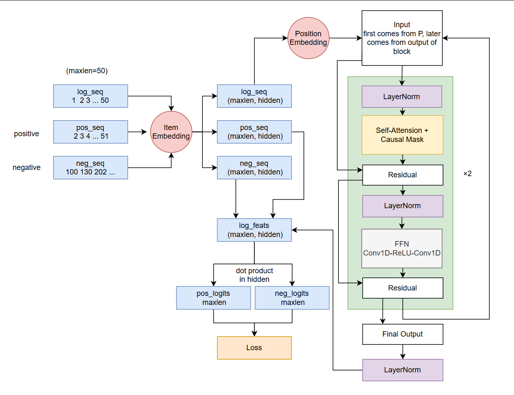
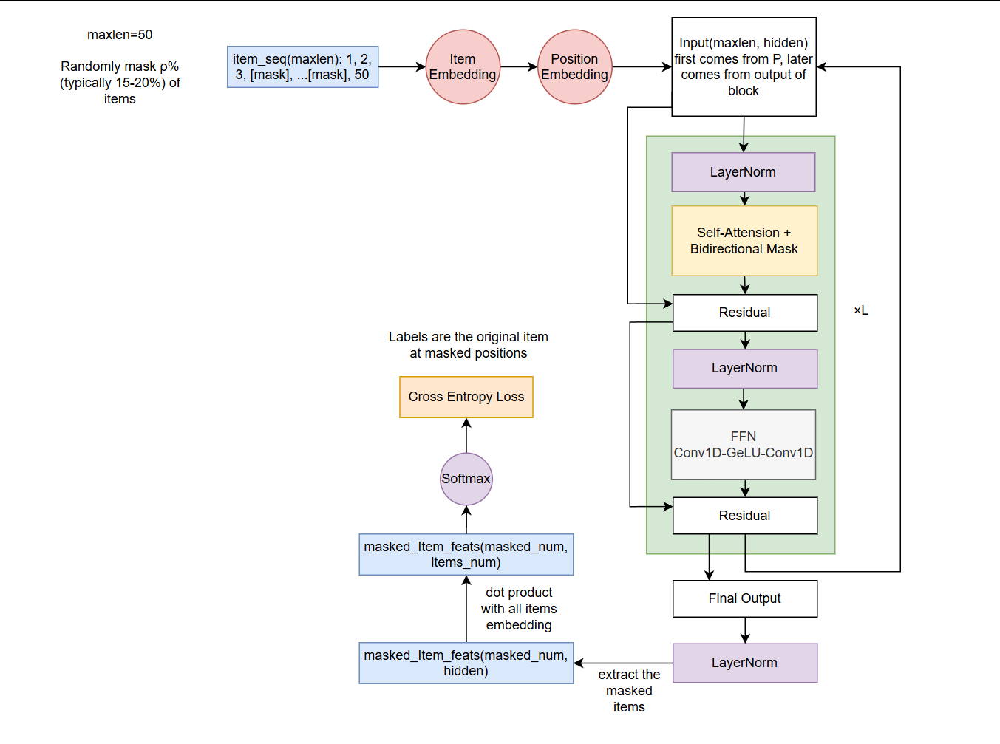
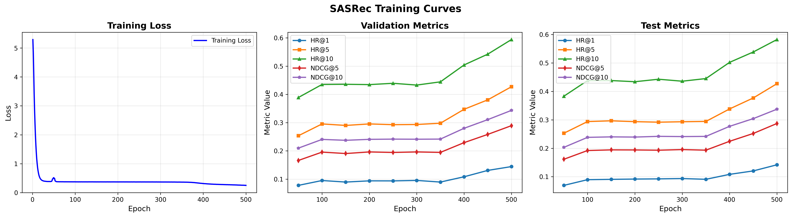
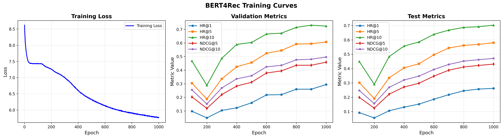

# Reference

SASRec Paper: https://arxiv.org/abs/1808.09781

BERT4Rec Paper: https://arxiv.org/abs/1904.06690

My code references the repository: https://github.com/pmixer/SASRec.pytorch 

My implementation may differ from the original paper.You can check my structure below. My BERT4Rec comes from the SASRec which just use an extra id as mask id.

# How to train

use `uv` to sync your python environment or just ensure your python environment has the packages in `pyproject.toml`.

then

```python
uv run SASRec.py
``` 

```python
uv run BERT4Rec.py
``` 

or just

```python
python SASRec.py
``` 

```python
python BERT4Rec.py
``` 

# Model Structure In My Code

## SASRec Structure



## BERT4Rec Structure



# Result

Obviously, you can train it more epochs. The models do not reach the best. Enjoy it!





# LICENSE

MIT
